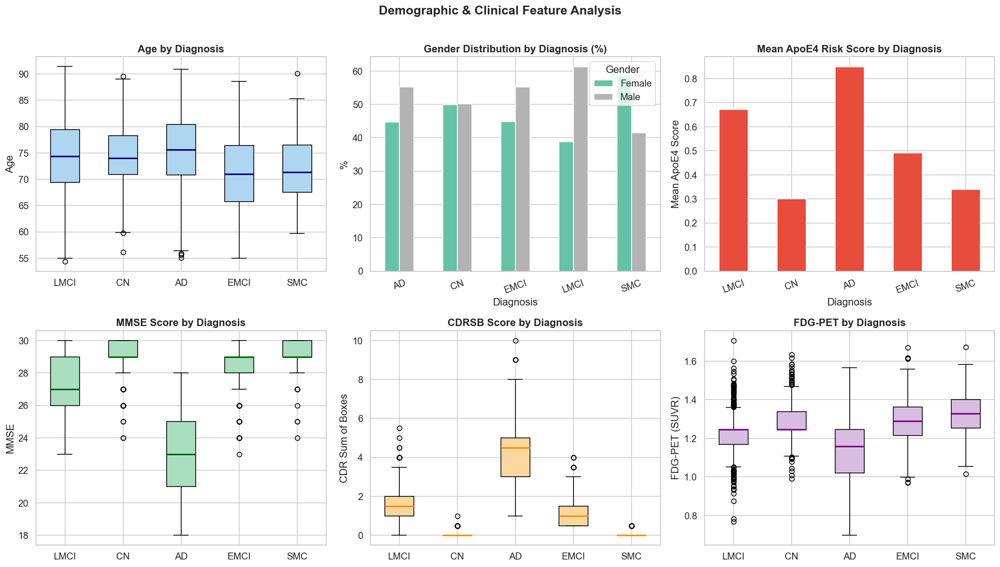
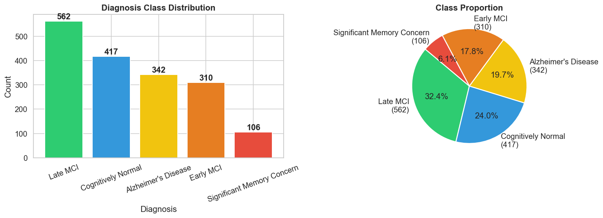
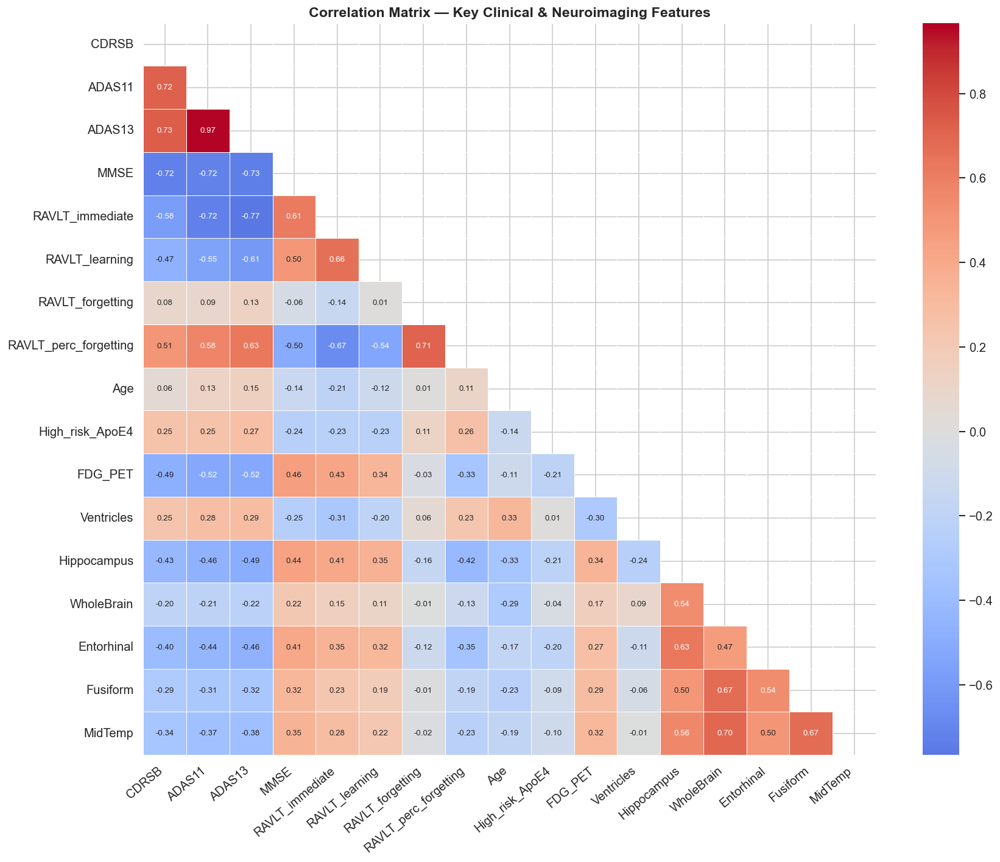
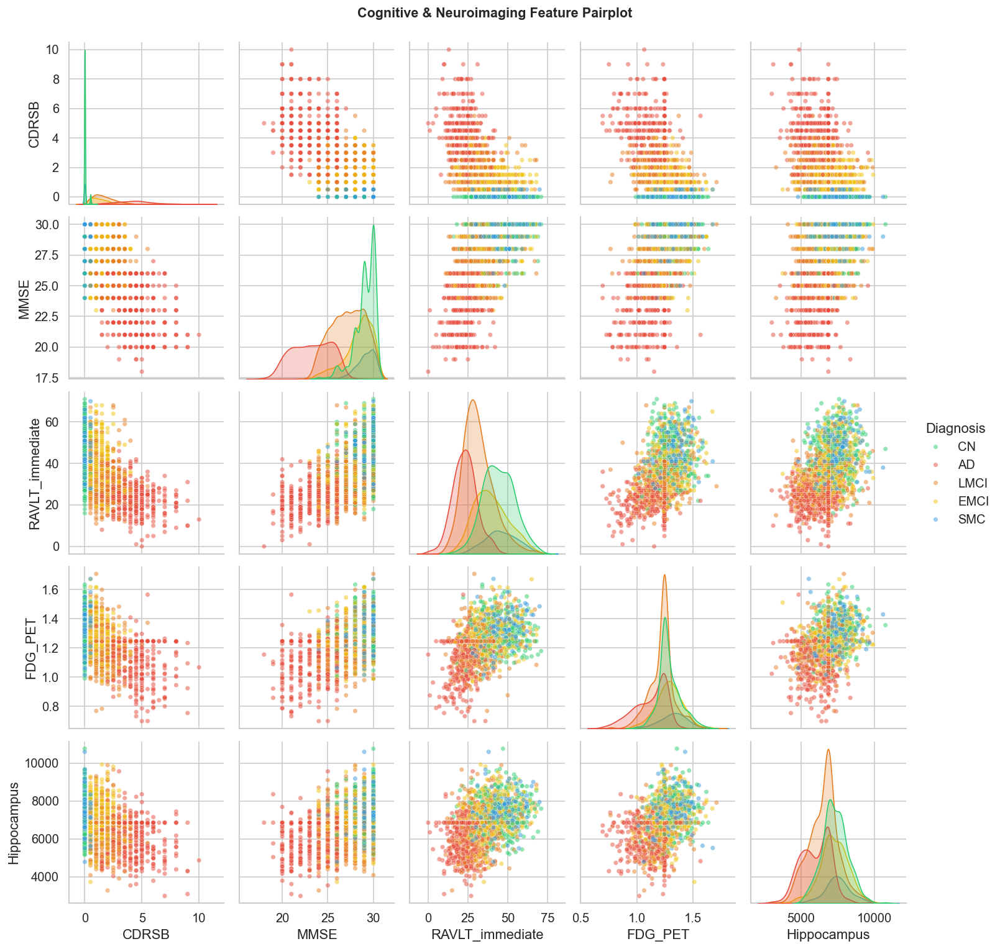
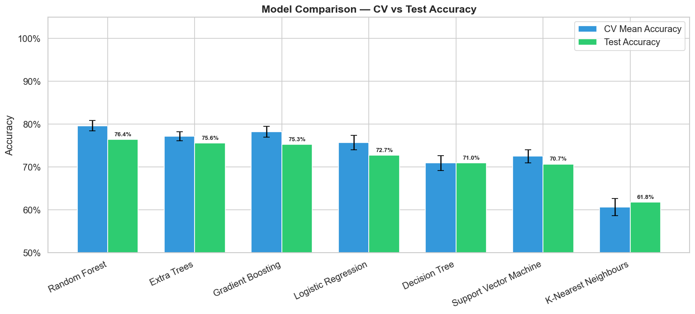
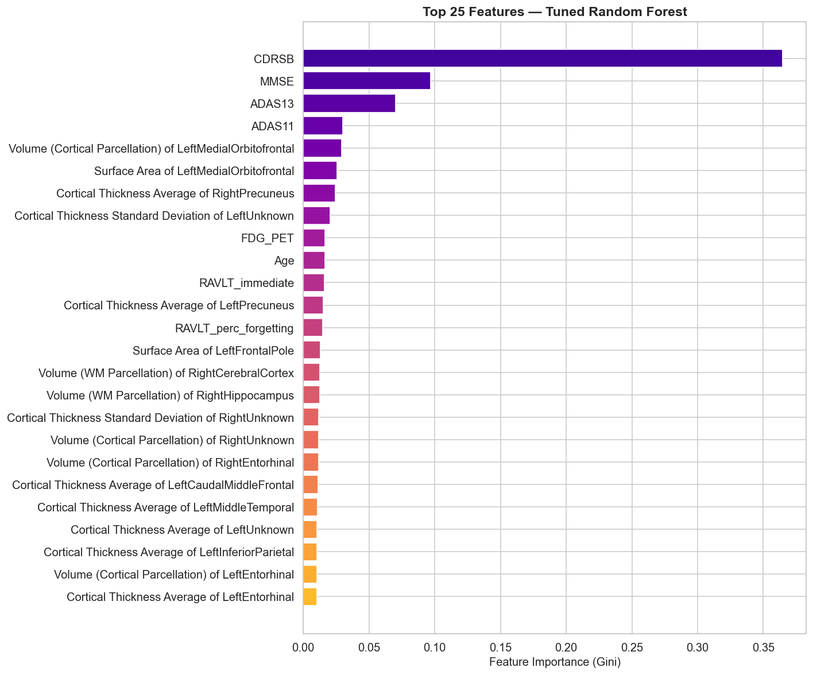
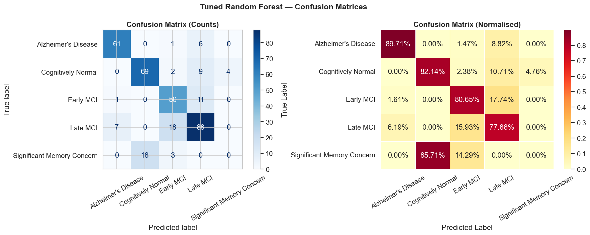
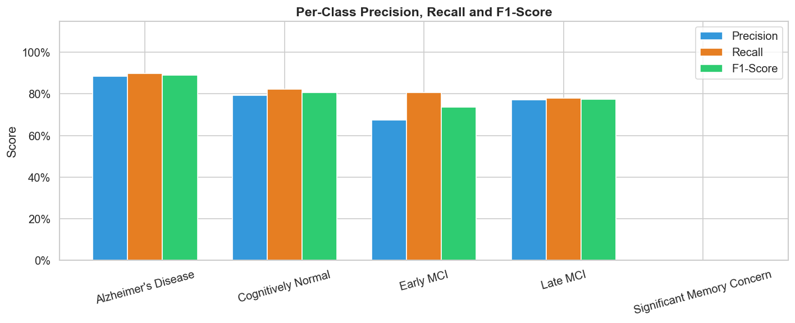
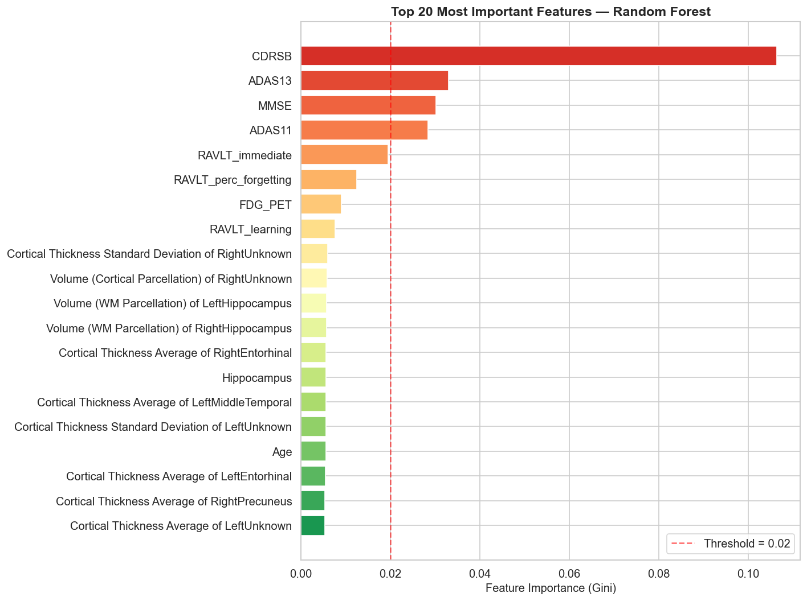
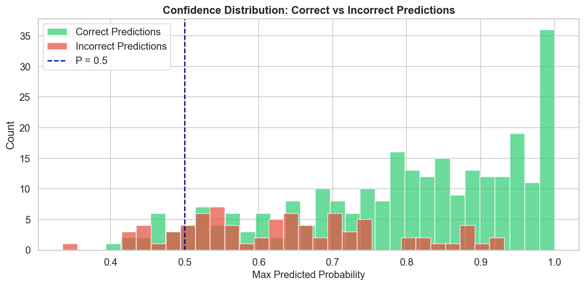

<div align="center">

# 🧠 Alzheimer's Disease Diagnosis
### End-to-End Machine Learning Pipeline


*Can a machine learn to see what the eye cannot? This project attempts exactly that.*

</div>

---

## 📌 Overview

Alzheimer's Disease is one of the most devastating neurodegenerative conditions on the planet — and one of the hardest to catch early. This project builds a **complete, production-style ML pipeline** for multi-class cognitive diagnosis, taking raw clinical and neuroimaging data all the way from messy CSVs to a tuned, explainable classifier.

No shortcuts. No black boxes. Every decision documented.

---

## 🎯 The Problem

Classify a patient into one of **5 cognitive stages**:

| Label | Meaning |
|-------|---------|
| `CN` | Cognitively Normal |
| `SMC` | Subjective Memory Concern |
| `EMCI` | Early Mild Cognitive Impairment |
| `LMCI` | Late Mild Cognitive Impairment |
| `AD` | Alzheimer's Disease |

This isn't binary. Five-class separation with real clinical overlap is genuinely hard — and that's the point.

---

## 📊 Dataset

> Data sourced from the **Alzheimer's Disease Neuroimaging Initiative (ADNI)** — the gold-standard longitudinal research program tracking MRI, PET scans, biomarkers, and cognitive assessments across hundreds of patients over years.

| Property | Value |
|----------|-------|
| Subjects | 1,737 |
| Raw Features | 371 |
| Features After Selection | 40 |
| Target Classes | 5 |

Features span **cognitive test scores** (MMSE, ADAS11, ADAS13, CDRSB), **FDG-PET imaging values**, **cortical volume measurements**, and **demographic attributes**.

---

## 🔬 Pipeline Walkthrough

```
Raw Data (1737 × 371)
       ↓
  Data Audit & EDA
       ↓
  Cleaning + Imputation + Encoding + Scaling
       ↓
  Feature Selection (371 → 40)
       ↓
  7 Models × Stratified 5-Fold CV
       ↓
  Best Model → RandomizedSearchCV Tuning
       ↓
  Evaluation + Explainability + Confidence Analysis
```

### 1️⃣ Exploratory Data Analysis

Understanding before modeling. Class distributions, demographic breakdowns, missing value maps, correlation heatmaps, and pairwise feature relationships — all visualized before touching a classifier.






---

### 2️⃣ Preprocessing

- Missing values handled via `SimpleImputer`
- Categorical features encoded with `LabelEncoder`
- All features normalized with `StandardScaler`
- `SelectKBest` + `mutual_info_classif` for feature selection

371 noisy features compressed to the **40 most informative signals**.

---

### 3️⃣ Model Benchmarking

Seven classifiers evaluated head-to-head under **Stratified 5-Fold Cross-Validation**:

| Model | CV Accuracy | Test Accuracy | F1 Score |
|-------|------------|---------------|----------|
| 🏆 Random Forest | 79.62% | 76.44% | 0.7419 |
| Gradient Boosting | 78.26% | 75.29% | 0.7409 |
| Extra Trees | 77.18% | 75.57% | 0.7313 |
| Logistic Regression | 75.66% | 72.70% | 0.7166 |
| Decision Tree | 70.91% | 70.98% | 0.7164 |
| Support Vector Machine | 72.50% | 70.69% | 0.6851 |
| K-Nearest Neighbours | 60.69% | 61.78% | 0.6107 |



---

### 4️⃣ Hyperparameter Tuning

Best candidate (Random Forest) pushed through `RandomizedSearchCV` — tuning `n_estimators`, `max_depth`, `min_samples_split`, `min_samples_leaf`, and `max_features`.



---

### 5️⃣ Evaluation & Results

```
╔══════════════════════════════════════════════╗
║        FINAL MODEL PERFORMANCE               ║
╠══════════════════════════════════════════════╣
║  Best CV Accuracy   :  79.84%                ║
║  Test Accuracy      :  77.01%                ║
║  Weighted F1 Score  :  0.7516                ║
╚══════════════════════════════════════════════╝
```




---

### 6️⃣ Explainability & Confidence

Feature importance analysis run both pre- and post-tuning. Top 5 predictive features:

| Rank | Feature | Clinical Meaning |
|------|---------|-----------------|
| 1 | **CDRSB** | Clinical Dementia Rating Sum of Boxes |
| 2 | **MMSE** | Mini-Mental State Examination |
| 3 | **ADAS13** | Alzheimer's Assessment Scale (13-item) |
| 4 | **ADAS11** | Alzheimer's Assessment Scale (11-item) |
| 5 | **Left Medial Cortical Volume** | Neuroimaging biomarker |

These align directly with established clinical literature — which means the model learned real signal, not noise.



**Confidence Distribution:**
- Mean confidence on **correct** predictions: `0.7996`
- Mean confidence on **incorrect** predictions: `0.6326`

A clear separation — the model *knows* when it's uncertain.



---

## 🛠️ Tech Stack

```python
numpy · pandas · matplotlib · seaborn
scikit-learn · jupyter
```

---

## 🚀 Getting Started

git clone https://github.com/Solivagus17/Alzheimer-s-Disease-Diagnosis-End-to-End-ML-Pipeline.git
cd Alzheimer-s-Disease-Diagnosis-End-to-End-ML-Pipeline

pip install -r requirements.txt

jupyter notebook Alzheimer_Analysis.ipynb

---

## 📁 Project Structure

```
├── Alzheimer_Analysis.ipynb     # Main pipeline notebook
├── Alzheimer_DataSet.csv        # Dataset
├── confusion_matrix.png
├── correlation_heatmap.png
├── eda_demographics.png
├── feature_importance.png
├── model_comparison.png
├── pairplot.png
├── per_class_metrics.png
├── prediction_confidence.png
├── target_distribution.png
└── tuned_feature_importance.png
```

---

## 📄 License

MIT License — free to use, fork, and build on.

---

<div align="center">

*Built with curiosity, caffeine, and a genuine belief that ML can matter in medicine.*

</div>
